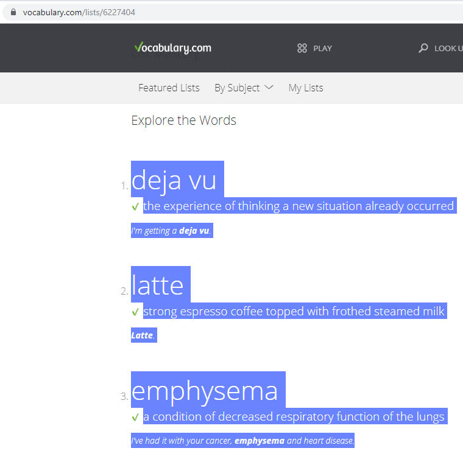
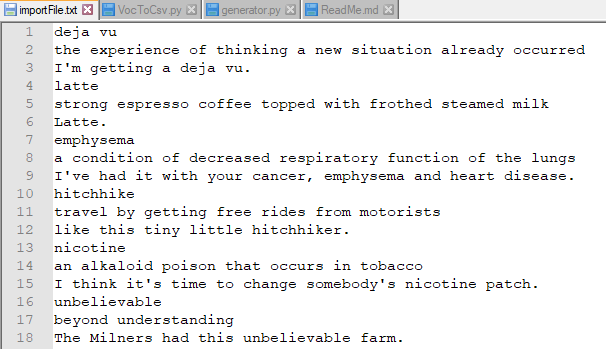

# ANKI Deck Generator

## how to use it

1. Open list of words on [https://www.vocabulary.com](https://www.vocabulary.com/)

2. Select all lines and copy-paste them to text file.

   1. first line: word

   2. second line: meaning

   3. third line: example

   

   

3. Run python script: 

   ```
   VocToCsv.py <your_file_name>
   ```

4. Open `<your_file_name>_export.apkg` to import it to `ANKI`.

## Prerequisites

1. python 3.7
2. google_speech
3. googletrans
4. genanki
5. Google-Images-Search
6. pip install "curses-2.2.1+utf8-cp37-cp37m-win32.whl" 
from https://www.lfd.uci.edu/~gohlke/pythonlibs/#curses